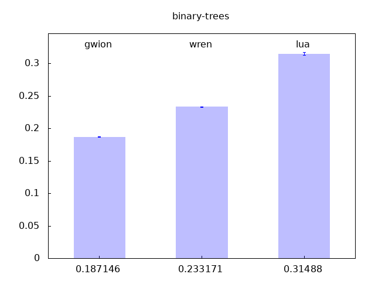
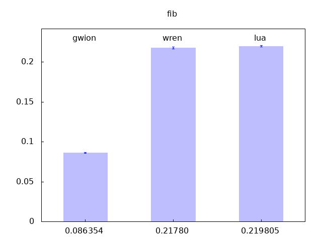
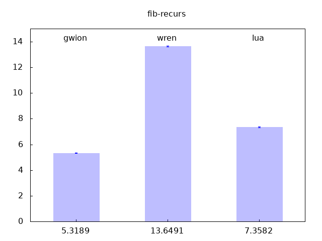

# Benchmarks

We'll need a bash script

<link rel=styleSheet href="../assets/doc.css" TYPE="text/css"><div id="org-categories"><ul class="lev1"><li><a href="#">Show the code</a></li><ul class="lev2"><a href="#">
``` sh
#!/bin/sh
language=("gwion" "wren" "lua")
extension=("gw" "wren" "lua")
test_dir="tests/benchmark"
plot_script="bench.plot"
: "${repeats:=10}"

run() {
  perf stat -r"$repeats" "$1" "$test_dir/$3.$2" 2>&1 | grep "time elapsed" |
    sed 's/ *\([0-9]*\),\([0-9]*\) .* seconds time elapsed *( +- *\([0-9]*\),\([0-9]*\)% )/\1.\2 \3.\4/'
}

get_list() {
  for file in $test_dir/*.gw
  do basename "$file" .gw
  done
}

get_test() {
  for (( i=0; i<=$(( ${#language[@]} -1 )); i++ ))
  do echo "${language[$i]} $(run "${language[$i]}" "${extension[$i]}" "$1")"
  done > "docs/assets/benchmark/$1.dat"
}

plot() {
  gnuplot -e "bench='$1'" "$plot_script"
}

for bench in $(get_list)
do
echo $bench
  get_test "$bench"
  plot "$bench"
  echo "### $bench"
  echo '<link rel=styleSheet href="../assets/doc.css" TYPE="text/css"><div id="org-categories"><ul class="lev1"><li><a href="#">Show the code</a></li><ul class="lev2"><a href="#">'
  echo "\`\`\`"
  cat "$test_dir/$bench.gw"
  echo "\`\`\`"
  echo '</a></a></li></ul></ul></div>'
  echo ""
done
```
</a></a></li></ul></ul></div>

### and a gnuplot script

<link rel=styleSheet href="../assets/doc.css" TYPE="text/css"><div id="org-categories"><ul class="lev1"><li><a href="#">Show the code</a></li><ul class="lev2"><a href="#">
``` plot
set terminal png truecolor

#if (!exists("bench"))
#  bench = 'bench'
if (!exists("test_dir"))
  test_dir = 'tests/benchmark'

dat_name = sprintf("docs/assets/benchmark/%s.dat", bench)

stats dat_name using 0:2 noout
max = STATS_max_y+(0.1*STATS_max_y)

set title bench
set output sprintf("docs/assets/benchmark/%s.png", bench)
set xrange [-0.5:((ceil(STATS_max_x))+0.5)]
set yrange [0:max]
set boxwidth 0.50
set nokey
set xtics nomirror
set ytics nomirror

set style fill transparent solid 0.25 # partial transparency
set style fill noborder # no separate top/bottom lines

plot dat_name using 0:2:($2*($3/100.0)):xtic(2) with boxerrorbar lc "blue" notitle, \
  '' using 0:(max-(0.05*max)):1 with labels
```
</a></a></li></ul></ul></div>

## Show the results
Then just run it
binary-trees
### binary-trees
<link rel=styleSheet href="../assets/doc.css" TYPE="text/css"><div id="org-categories"><ul class="lev1"><li><a href="#">Show the code</a></li><ul class="lev2"><a href="#">
```
// Ported from the Wren version.

class Tree {
  int item;
  Tree @left, right;

  fun static Tree new_Tree(int it, int depth) {
    Tree t;
    it => t.item;
    if (depth > 0) {
      it + it => int item2;
      --depth;
      Tree.new_Tree(item2 - 1, depth) @=> t.left;
      Tree.new_Tree(item2, depth) @=> t.right;
    }
    return t;
  }

  fun int check() {
    if (!left)
      return item;
    return item + left.check() - right.check();
  }
}

4 => int minDepth;
12 => int maxDepth;
maxDepth + 1 => int stretchDepth;

<<< "stretch tree of depth ", stretchDepth, " check: ",
  Tree.new_Tree(0, stretchDepth).check() >>>;

Tree.new_Tree(0, maxDepth) @=> Tree@ longLivedTree;

// iterations = 2 ** maxDepth
1 => int iterations;
for (int d; d < maxDepth; ++d)
  2 *=> iterations;

minDepth => int depth;
while (depth < stretchDepth) {
  int check;
  for (int i; i < iterations; ++i)
    Tree.new_Tree(i, depth).check() + Tree.new_Tree(-i, depth).check() +=> check;

  <<< iterations * 2, " trees of depth ", depth, " check: ", check >>>;
  4 /=> iterations;
  2 +=> depth;
}

<<< "long lived tree of depth ", maxDepth, " check: ", longLivedTree.check() >>>;
```
</a></a></li></ul></ul></div>

fib
### fib
<link rel=styleSheet href="../assets/doc.css" TYPE="text/css"><div id="org-categories"><ul class="lev1"><li><a href="#">Show the code</a></li><ul class="lev2"><a href="#">
```
class Fib {
  fun static int get(int n) {
    if (n < 2) return n;
    return get(n - 1) + get(n - 2);
  }
}
repeat(5)
  <<< Fib.get(28) >>>;
```
</a></a></li></ul></ul></div>

fib-recurs
### fib-recurs
<link rel=styleSheet href="../assets/doc.css" TYPE="text/css"><div id="org-categories"><ul class="lev1"><li><a href="#">Show the code</a></li><ul class="lev2"><a href="#">
```
fun int recursive_fib(int n) {
    if (n < 2)
        return n;
    else
        return recursive_fib(n - 2) + recursive_fib(n - 1);
}
//<<< 5 => recursive_fib >>>;
<<< 40 => recursive_fib >>>;
```
</a></a></li></ul></ul></div>

method-call
### method-call
<link rel=styleSheet href="../assets/doc.css" TYPE="text/css"><div id="org-categories"><ul class="lev1"><li><a href="#">Show the code</a></li><ul class="lev2"><a href="#">
```
class Toggle {
  bool state;
  fun bool value() { return state; }
  fun Toggle activate() {
    !state => state;
    return this;
  }
}

class NthToggle extends Toggle {
  int count, countMax;
  fun Toggle activate() {
    if(++count >= countMax) {
      (this $ Toggle).activate();
      0 => count;
    }
    return this;
  }
}

100000 => int n;

Toggle toggle;
true => bool val => toggle.state;

repeat(n) {
  toggle.activate().value() => val;
  toggle.activate().value() => val;
  toggle.activate().value() => val;
  toggle.activate().value() => val;
  toggle.activate().value() => val;
  toggle.activate().value() => val;
  toggle.activate().value() => val;
  toggle.activate().value() => val;
  toggle.activate().value() => val;
  toggle.activate().value() => val;
}

<<< toggle.value() >>>;

NthToggle ntoggle;
true => val => ntoggle.state;
3 => ntoggle.countMax;

repeat(n) {
  ntoggle.activate().value() => val;
  ntoggle.activate().value() => val;
  ntoggle.activate().value() => val;
  ntoggle.activate().value() => val;
  ntoggle.activate().value() => val;
  ntoggle.activate().value() => val;
  ntoggle.activate().value() => val;
  ntoggle.activate().value() => val;
  ntoggle.activate().value() => val;
  ntoggle.activate().value() => val;
}

<<< ntoggle.value() >>>;
```
</a></a></li></ul></ul></div>

